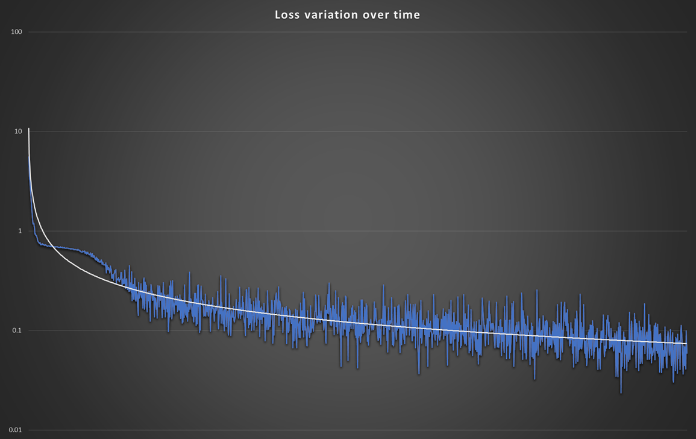
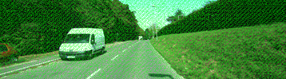
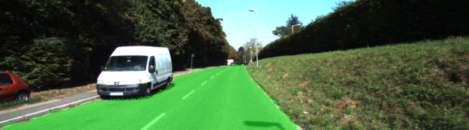

# Semantic Segmentation
### Introduction
In this project, the pixels of the road of some images will be labeled using a Fully Convolutional Network (FCN).


### Setup
##### Frameworks and Packages
Make sure you have the following is installed:
 - [Python 3](https://www.python.org/)
 - [TensorFlow 1.0](https://www.tensorflow.org/)
 - [NumPy 1.12](http://www.numpy.org/)
 - [SciPy 0.19](https://www.scipy.org/)
##### Dataset
Download the [Kitti Road dataset](http://www.cvlibs.net/datasets/kitti/eval_road.php) from [here](http://www.cvlibs.net/download.php?file=data_road.zip).  Extract the dataset in the `data` folder.  This will create the folder `data_road` with all the training a test images.

### Start

##### Run
Run the following command to run the project:
```
python main.py
```

### Information

The final model uses a batch size of 2, learning rate of 1e-4, keep probability of .5 and runs for 10 epochs. The loss decreases over time, probably running for more epochs will improve the results. It took 38 minutes in a g3.4xlarge instance from Amazon with a NVIDIA Tesla M60 GPU to train.



It uses Adam Optimizer and L2 regularization. On the second epoch results looked like this:



But it got much better (epoch number 10):




